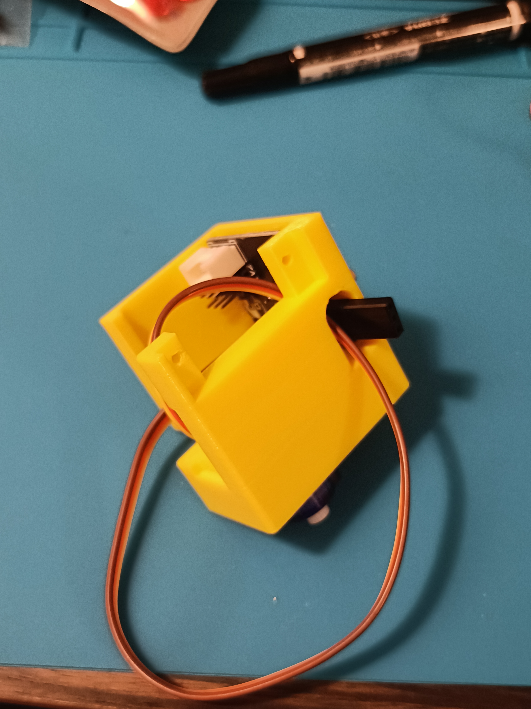
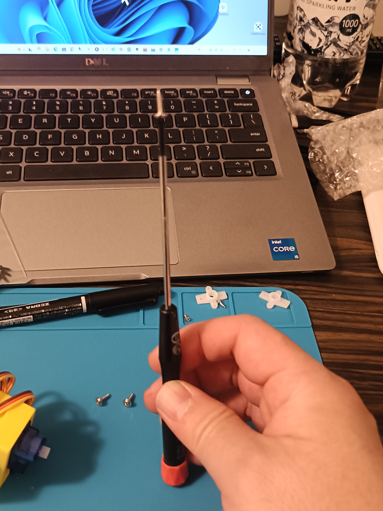
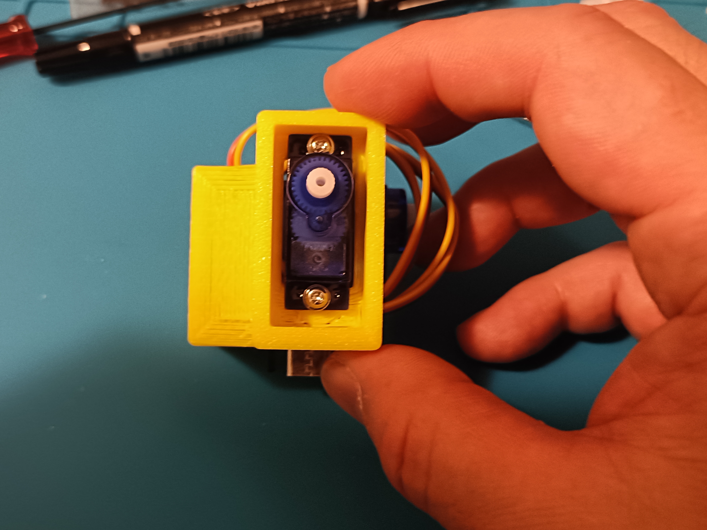
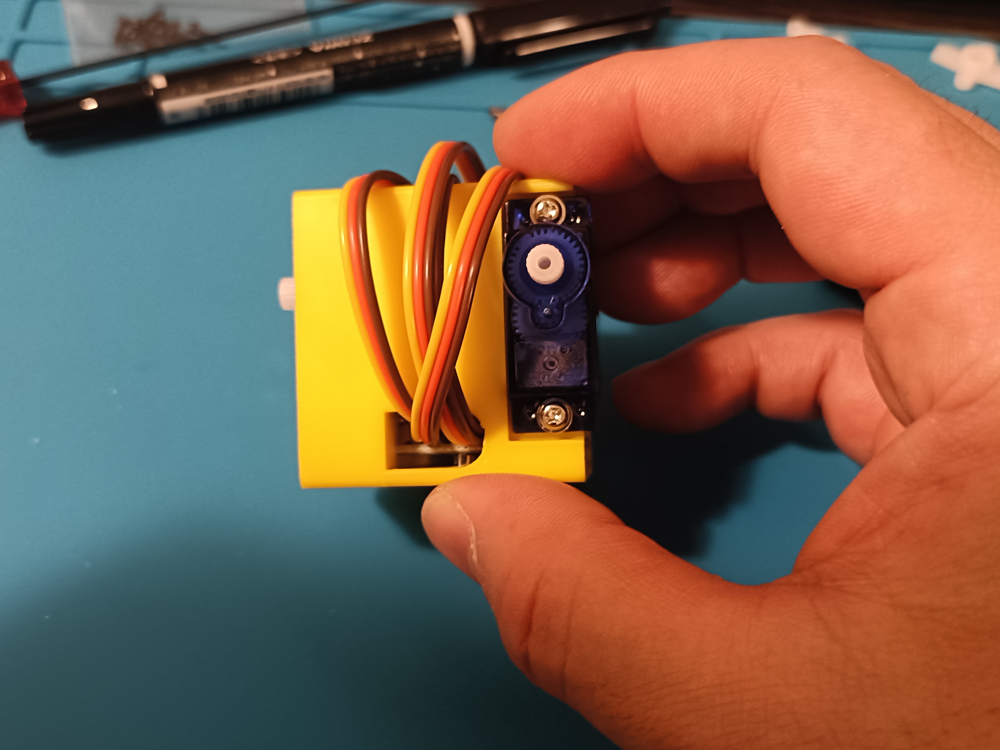

# ブラケットの組み立て

## 用意するもの
- ブラケット
- Stack-chan_Takao_Base
- M2 x 4mmボルト x 2本
- サーボ
  - サーボホーン(十字のもの、ニッパーでカットし1.5mmのドリルで下穴を開けています。)
  - サーボ付属の皿ネジ x 2本 少し長めのもの
  - サーボホーン固定用のネジ 短めのもの

## 組み立ての手順

### ①基板を固定

1. Stack-chan_Takao_Baseをブラケットに組み合わせる。 写真のように、Type-Cコネクタと電源スイッチが穴にハマるようにStack-chan_Takao_Baseをブラケットに固定します。

1. Stack-chan_Takao_BaseをM2 x 4mmボルトで固定する。 基板に空いている2箇所の穴にM2 x 4mmボルトを捩じ込んで基板を固定します。基板が動かなくなる程度まで締めます。

### ②水平方向のサーボをセットする。

1. コネクタをブラケットの下側から穴を通してサーボを差し込みます。

1. サーボのケーブルを2回通して巻く そのままだとサーボのケーブルが長いので、ブラケットの小窓部分にコネクタを内側から通して2回巻きます。（長さ調整）

1. 2回巻いた後、H2コネクタに接続 正面から見て、茶色・赤・黄色という方向でピンヘッダにサーボのコネクタ（ソケット）を挿しこみます。

### ③垂直方向のサーボをセットする。

1. 垂直方向のサーボもコネクタをブラケットの小窓に２回通してケーブルを巻きます。（長さ調整）

1. 2回巻いた後、V1コネクタに接続 正面から見て、茶色・赤・黄色という向きでピンヘッダにサーボのコネクタ（ソケット）を挿しこみます。

### ④サーボを固定する

サーボ付属の皿ネジを4本使って、それぞれのサーボを固定します。

ネジがすぐに落ちてしまう時は、下の写真のようにドライバーを上向きにしてネジを固定して、穴の方をこれに合わせるとねじ込みやすくなります。

1. 水平方向のサーボを固定（締め過ぎ注意。サーボが動かなくなればOKです。）

1. 垂直方向のサーボを固定（締め過ぎ注意。サーボが動かなくなればOKです。）

