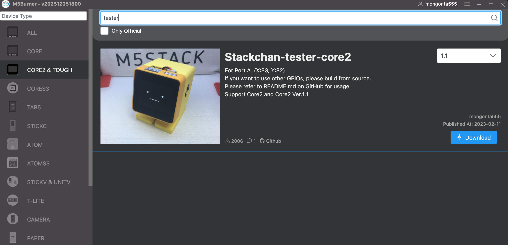

# サーボのテストと初期位置の設定

## M5BurnerでStack-chan-testerを書き込み
M5Burnerを起動して、それぞれに合ったStack-chan-testerを書き込みます。書き込んだ後に、顔が表示されて吹き出しに文字列が表示されればOKです。

- M5Stack Basic/Gray/Fire 「CORE」->「Stackchan-tester-core」
- M5Stack Core2/Core2 for AWS 「CORE2&TOUGH」->「Stackchan-teseter-core2」
- M5Stack CoreS3/S3SE 「CORES3」-> 「Stackchan-tester-CoreS3」

## Groveケーブルの接続

Stack-chan_Takao_BaseのGroveコネクタMM5Stack CoreのPort.A（赤いコネクタ）を接続します。

## サーボの動作確認と90°の固定

接続して、M5StackがONになっていると、サーボが90°の位置に固定されます。（ここが基準点＝正面の位置です。）
BtnBを押すと、サーボが動き出します。(水平方向に0->180->90, 垂直方向に90->60->90という動きを２回繰り返します。)

<strong>CoreS3の場合は、タッチパネルの画面下320x40の範囲がBtnA,B,Cとなります。</strong>

停止した位置が、ｽﾀｯｸﾁｬﾝの正面の向き(90°)なので、サーボホーン、シェル、足の固定時にズレないように注意してください。

★SG90サーボは0〜180°で動くようになっており、ｽﾀｯｸﾁｬﾝでは中心の90°の位置が正面になるように設計されています。

