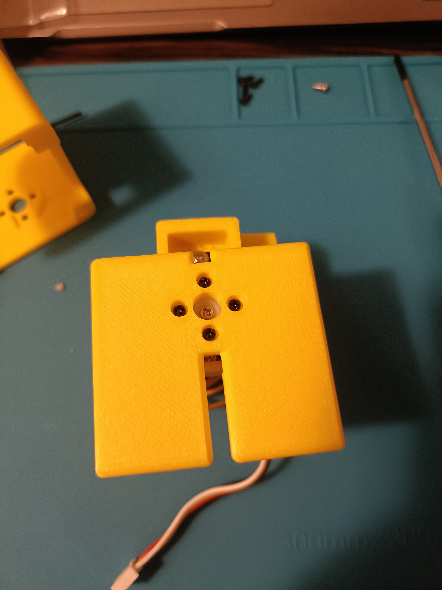

# 足の組み立て

サーボホーンを足に固定します。写真のように穴の位置を合わせて足の裏側からM１.7ネジ4本で固定します。

この時、サーボホーンと足の間に隙間が開かないように注意してください。ネジの先は尖っているので指に刺さり易いので怪我にも注意してください。

# 足をブラケットに取り付ける。

ギアを動かさないように注意しながら、ブラケットの水平方向のサーボに足を固定します。固定した後にサーボに付属している短いネジでサーボホーンとサーボを固定します。

# 足の取り付けが完了するとこのようになります。

